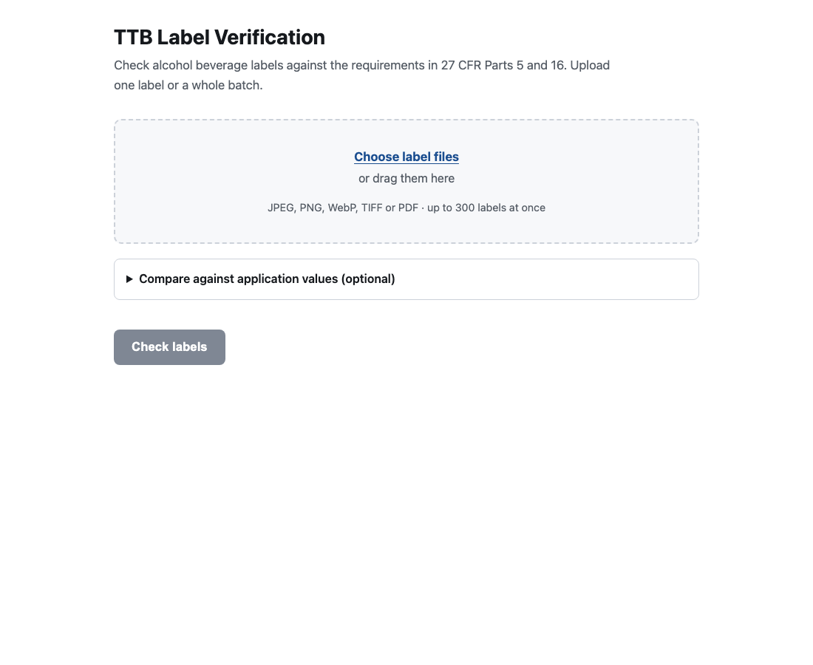
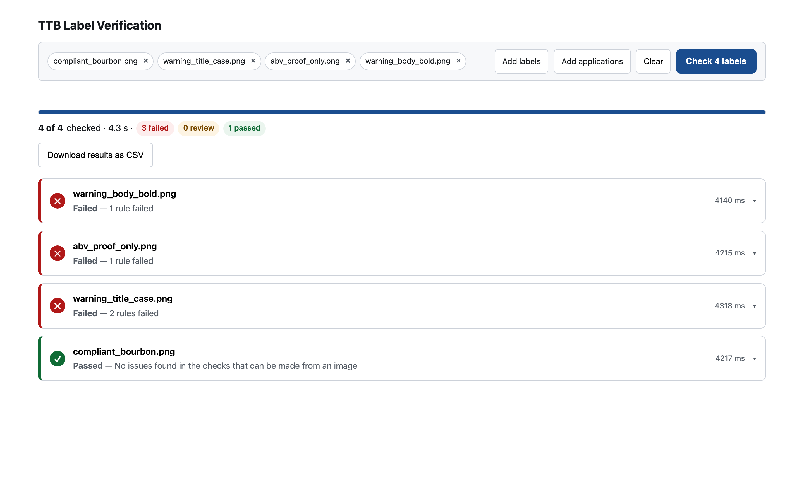
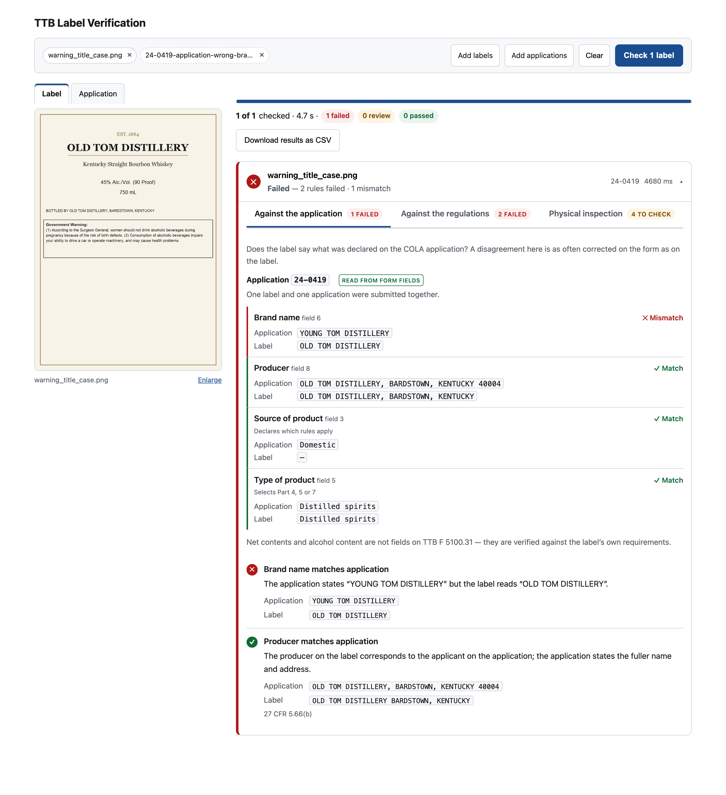

# TTB Label Verification

Drop in a label and the COLA application it belongs to. Both documents are read for you,
compared field by field, and checked against **27 CFR Parts 5 and 16** — with the
regulation cited for every finding and the source documents shown so you can verify the
comparison rather than perform it.

**Live:** https://ttb-label-verification-production-a79a.up.railway.app

Built as a take-home assessment for IT Specialist (AI), Treasury Common Services Center.

---

## What it does

Reads the printed information off a label image, then checks it against the regulations:

- **Government health warning** — exact text per §16.21, heading in capitals and bold,
  body *not* bold per §16.22(a)(2), set apart from other information
- **Mandatory fields** — brand name, class/type, alcohol content, net contents, producer
  name with its function phrase, country of origin for imports
- **Against the application** — compare the label to what was declared on the COLA
  application (TTB F 5100.31)

Every finding names the regulation it came from. Results stream in as each label
finishes, so an agent starts work on a 300-label batch within about four seconds rather
than waiting for the whole run.

### Nothing is retyped

Sarah describes the job plainly: *"a lot of what we do is just... matching. My agents
spend half their day doing what's essentially data entry verification."* A tool that asks
an agent to type the application values in order to check them has not removed that work.
So both documents are uploaded and both are read.

**The application is read from the form itself.** TTB F 5100.31 is a fillable AcroForm, so
a digitally completed application is read straight out of its fields — exact strings, no
model, no inference. A form that was printed and scanned falls back to the same vision
extraction the label uses. Which path ran is shown on every result, because an agent should
know whether a value was read or inferred.

**Pairing never guesses.** The serial number identifies an application, but it is never
printed on a label — it is not a labelling requirement under Parts 4, 5, 7 or 16 — so the
two cannot be matched by content. A single label and application pair directly; a batch
pairs on the serial in the filename, then a shared filename, then an unambiguous brand. Two
applications sharing a brand is a question, not a pair, and anything unmatched is reported
with what would fix it.

**The field set follows the form.** There is no field for the class/type designation —
field 5 declares the commodity, wine or spirits or malt beverages, which is a different
thing — and none for net contents or alcohol content. Those are verified against the
label's own requirements instead. What the form does declare is
more useful than any string comparison: **field 3, Domestic or Imported**, settles the
country-of-origin requirement instead of inferring it from the producer's wording, and
**field 5** decides whether Part 5 applies at all rather than guessing from the label.

### Three results, not two

`PASS` · `FAIL` · **`REVIEW`**

The third one is the point. This tool exists to clear routine matching off a 47-person
team's desk, not to make final determinations, and two failure modes pull in opposite
directions. Silently passing something a human would have caught defeats the purpose.
Hard-failing something obviously fine — `STONE'S THROW` against `Stone's Throw` — makes
the tool worse than the eye it replaced, and it gets abandoned. `REVIEW` is the honest
answer when a requirement is met in substance but not in form, or when a photograph
cannot supply the evidence a rule needs.

### The interface

One screen. Drop in a label or three hundred; results stream in as each finishes, sorted
worst-first so an agent works the rejections rather than scrolling past the passes.





A single review puts the source documents beside the findings, so an agent can check what
the tool read rather than take its word for it. Findings are split by the question they
answer: whether the label agrees with the application, whether it satisfies the
regulations, and what can only be settled against the physical bottle.



---

## Quickstart

```bash
git clone https://github.com/iamnathanswan/ttb-label-verification
cd ttb-label-verification

cp .env.example .env          # add a workspace-scoped ANTHROPIC_API_KEY
python -m venv .venv && .venv/bin/pip install -e ".[dev]"
cd web && npm install && npm run build && cd ..

.venv/bin/uvicorn app.main:app --reload    # http://localhost:8000
```

### Try it

Ready-made pairs are in [`samples/`](samples/) — a label and the COLA application it
belongs to, with a note on what each should do. Drop both files on the page together.

| | |
|---|---|
| `01-everything-matches` | The clean path |
| `02-brand-case-differs` | `STONE'S THROW` against `Stone's Throw` — review, not rejection |
| `04-declared-import-no-origin` | Caught only because the application declares it |
| `06-scanned-application` | A printed-and-scanned form, read by sight |
| `07-warning-body-bold` | §16.22(a)(2) — a defect OCR cannot see at all |
| `10-mixed-batch` | Six labels and seven applications at once — each finds its own, the spare is reported |

Or with Docker, which is what deploys:

```bash
docker build -t ttb . && docker run -p 8000:8000 --env-file .env ttb
```

### Tests

```bash
.venv/bin/pytest -q                        # 200 tests, no network, no API key needed
cd web && npm test                         # 22 tests
python scripts/gen_traceability.py --check # fails if a requirement has no test
```

---

## Why a model, and not OCR

A fair question, so it was measured rather than assumed.

On a clean label Tesseract reads everything correctly in about 520 ms, for free, case
included. If reading text were the whole job, a model would be over-engineering. Two
things stop it being the whole job.

**Typography is invisible to OCR.** `compliant_bourbon.png` and `warning_body_bold.png`
produce byte-identical OCR output. The only difference between those labels is that the
warning body is bold, which §16.22(a)(2) forbids. `VAL-03` and `VAL-04` cannot be built on
text extraction at all.

**Photographs break it.** The same label rotated 7°, lightly blurred and with glare across
the middle — Jenny's exact scenario:

| | Tesseract | This tool |
|---|---|---|
| Brand, class/type, ABV, net contents | all lost | all read |
| Warning text | `"rink ay beverages uring"` | matches §16.21 exactly |
| Verdict | would **FAIL** a compliant label | `PASS` |

A false rejection is the worst error this tool can make; it is how the previous vendor
pilot lost its users.

**Cost, measured:** `$0.0121` per label with the prompt cache warm. Across 150,000
applications a year that is about **$1,800** — against roughly **$787,000** of review time
at 47 agents and 5–10 minutes each. Inference is a rounding error on the work it assists.

Where something *can* be read mechanically, it is: a digitally completed application is
read from its AcroForm fields in about 10 ms with no model call at all.

## Approach

### The model extracts; code judges

Exactly one call in this system is non-deterministic, and it returns a validated
`LabelFields` object. Every compliance determination is a pure function over that object
— no network, no second model call.

```
image ──▶ ingest ──▶ [ model ] ──▶ LabelFields ──▶ rules ──▶ PASS · REVIEW · FAIL
          resize      the only        pydantic      pure          + citation
          EXIF        inference                     functions
          PDF         boundary
```

This is not stylistic. A compliance decision has to be reproducible, auditable, and
explainable by citation — a regulator asks *which rule, and what does it say*, not *what
did the model think*. It also means the entire rule suite runs in milliseconds with no
API key, which is why the test suite needs neither.

The model is never asked whether a label complies. It is asked only what is printed.

### Deliberately not shown the answer

The extraction prompt does **not** contain the §16.21 warning text. Showing the model the
canonical wording invites it to report the canonical wording, silently repairing the exact
defects the check exists to catch — a label reading "Government Warning" in title case
would come back normalised. The model transcribes; the comparison happens in code.

### Opposite normalisation, on purpose

`rules/warning.py` compares the warning after whitespace normalisation **only**. §16.21
prescribes the statement word for word, so a title-case heading is a genuine rejection.

`rules/match.py` folds case, punctuation, accents and spacing, because a brand-name
casing difference is not a discrepancy.

The two policies conflict by design and must never share a helper.

### What a photograph cannot decide

§16.22 sets minimum type size in millimetres and maximum characters per inch. An image
carries no reliable scale, so these checks report the applicable threshold and route to a
person — they never produce an automated failure.

They also never affect the verdict. An advisory that fires identically on every label
carries no information about *this* label, and folding it into the result would make every
result `REVIEW` — which tells an agent nothing and abandons the triage the tool is for.
Advisories are shown under their own heading, clearly marked.

---

## Technical choices, and why

Every choice below had a plausible alternative. Decisions are tabulated as D1–D9 in
`docs/plan.md`; this is the reasoning behind them.

### Python and FastAPI

The work this service does is image handling, PDF form reading, and one model call.
Pillow, PyMuPDF and the Anthropic SDK are all first-class in Python and would have been
bindings or subprocesses anywhere else. FastAPI adds two things that mattered here rather
than in general: **Pydantic models are the schema**, so `LabelFields` is simultaneously the
extraction contract, the validation boundary and the API response shape — declared once,
which is why a field cannot drift between them — and **native async**, which the batch
fan-out depends on, since three hundred labels are I/O-bound on one API and a
`Semaphore` over `asyncio` is the whole implementation.

*Rejected:* Flask, which would have meant adding an async story and a serialisation layer
to reach the same place. Node for the whole stack, which would have put PDF form reading on
weaker libraries — `pymupdf`'s AcroForm access is the reason the application is read
exactly rather than by model.

### React, built and served by the API

One screen with streaming results and expandable findings is state that would be awkward in
templates and trivial in components. Vite compiles it to static files that FastAPI serves
directly.

**This is one service, not two** (D1). The deliverable is *a* URL. A split deployment would
have meant CORS, two things to deploy, two things to fail, and a second origin to explain —
for a prototype nobody will scale independently. Everything the browser needs comes from the
same origin, which also removes a class of security question.

*Rejected:* Next.js or any SSR framework — there is nothing to server-render and it would
have added a second runtime to the container. A server-rendered template stack — the
streaming batch view is genuinely interactive.

### Claude Sonnet 5

Chosen by measurement against a binding requirement, not by preference or cost. Opus 5 was
the plan of record and missed the ~5 s budget at **5,590 ms**. Sonnet 5 meets it at
**p50 4,185 ms** with identical accuracy on the fixtures that discriminate — the typographic
ones, where a wrong answer flips a verdict. Cost came out at `$0.0121` per label, which is a
rounding error against the review time it assists, so it was never the deciding factor.
Configurable via `ANTHROPIC_MODEL`; the measurements are in `docs/perf.md`.

The model is also *deliberately small in scope*: it transcribes, and code judges (D2). That
is what makes a wrong model output a misread field rather than a wrong verdict.

### Docker, and Railway

The Dockerfile is a two-stage build — Node compiles the bundle, then a `python:3.12-slim`
runtime serves it. It is the deployment artifact and also what you can run locally, so
"works on my machine" and "works in production" are the same image.

**Railway is the least interesting decision here, and deliberately so.** It takes a
Dockerfile, injects `$PORT`, and gives an HTTPS URL. It was chosen because an account
already existed and was funded, and because nothing about this prototype needs more than
that. Any container host — Render, Fly, Cloud Run, App Service — would serve identically. The
entire coupling is three things, none of them deep: `railway.json`, which says *build the
Dockerfile* and *health-check `/api/health`*; reading `$PORT`, which every container host
sets; and preferring `RAILWAY_GIT_COMMIT_SHA` when stamping the running revision onto
`/api/health`, which falls back to `GIT_COMMIT` and `SOURCE_COMMIT`. No platform SDK, no
managed service, no build step that only works there.

That portability is the point rather than an accident, for the reason below.

---

## The production path: Azure, FedRAMP, and the firewall

Marcus raised two constraints that do not bind this prototype but would bind a real
deployment, and conflating those two things would be the easy mistake.

**"Our network blocks outbound traffic to a lot of domains."** During the scanning vendor
pilot, half the features failed because the firewall blocked their ML endpoints. That
happened because the vendor's product called out *from inside* TTB's network. This tool
does not: an agent's browser makes one outbound connection, to this HTTPS URL, and the
inference call is made by the application host. The firewall governs traffic leaving TTB;
this traffic leaves a container elsewhere. For a prototype opened in a browser, the
constraint genuinely does not apply.

**It absolutely applies in production**, and the remedy is not a firewall exception. Asking
a federal network to allow-list a commercial API endpoint is the request that gets refused,
and should be. The remedy is moving inference inside the trust boundary.

**Azure is the natural target.** TTB migrated in 2019, and FedRAMP authorisation is the gate
Marcus described as eighteen months of paperwork — which is an argument for landing inside
an already-authorised boundary rather than establishing a new one. Concretely that means
Claude on a FedRAMP-authorised Azure deployment, called from a service running in TTB's own
subscription, with no egress to the public internet.

**The architecture is already arranged for that**, and it is one of the few decisions taken
on day one specifically for a constraint the prototype does not have:

```python
class ExtractionProvider(ABC):
    async def extract(self, image_bytes, media_type) -> tuple[LabelFields, dict[str, int]]: ...
    async def extract_application(self, image_bytes, media_type) -> ApplicationFields: ...
```

Two methods, and that is the whole interface. `AnthropicProvider` implements it,
`StubProvider` backs the test suite, and an `AzureProvider` would be a third — **a
constructor change, not a rewrite**. Nothing else in the codebase knows a model exists.

This is enforced rather than intended: `tests/test_provider_seam.py` walks every source file
and fails if anything outside `app/providers/` imports the vendor SDK. The seam cannot rot
quietly, because the build breaks when it does.

Two further properties make that migration smaller than it sounds:

- **Every compliance determination is already deterministic** (D2). Swapping the model
  changes what is transcribed, never how a rule is decided, so the regulatory logic needs no
  revalidation — the 200 tests run with no network and no key.
- **Nothing is persisted** (D7, `OPS-01`). Uploads live in memory for the request. There is
  no data store to migrate, no retention policy to write, and no PII at rest to assess —
  which removes most of what makes a federal authorisation slow.

**Not done:** there are no FedRAMP artifacts, no ATO package, and no Azure deployment.
Those are out of scope for a prototype (`docs/requirements.md` §I). What is done is making
sure nothing here forecloses the path.

---

## How this was built

Specification first, and deliberately: the brief's requirements are spread across four
interview transcripts, and the things most easily missed — that the warning body may *not*
be bold, that a vendor taking 30–40 seconds per label is the benchmark "about 5 seconds" is
measured against — are said once, in passing, by one person.

So every requirement was extracted to `docs/requirements.md` with a stable ID and, where it
is binding, the sentence it came from. `docs/plan.md` records the architecture and the
decisions; `docs/tasks.md` breaks it into phases with each task naming the requirements it
satisfies; `docs/traceability.md` is generated and cross-checks that every buildable
requirement has a covering test. `python3 docs/check_coverage.py` fails the build if an ID
is referenced but never defined, or defined but never covered.

The value of that machinery was not planning. It was that **five ambiguities in the brief
became visible as ambiguities** rather than as assumptions someone made silently. They are
recorded in `requirements.md` §J with how each was resolved.

### The design was wrong once, and the specification is where that is recorded

§J-1 asks whether this is label-only verification or label-versus-application matching. The
explicit requirements list label fields only; the interviews describe something else
entirely. It was first resolved as *build both, with matching optional* — and the matching
half took the application values by hand, typed into a panel or uploaded as a CSV.

That satisfied the letter of both readings and defeated the point of one. Sarah's
description of the job is agents *"drowning"* in **data entry verification**; a tool that
asks an agent to type the application values is asking for exactly the work it exists to
remove. The application is also a filled PDF form, not a spreadsheet — the CSV had been
designed for an artifact that does not exist.

So it was rebuilt. Both documents are now dropped in and both are extracted: the
application straight from the AcroForm widgets of TTB F 5100.31, with no model involved,
falling back to vision only for a form that was printed and scanned.

The commit history shows this happening rather than hiding it, and §J-1 records the first
resolution and why it was wrong alongside the one that replaced it. Superseded tasks and
decisions are struck through in `tasks.md` and `plan.md` rather than deleted. A
specification that only ever agreed with the finished system would be a description written
afterwards, not a record of the work.

## Measured

| | |
|---|---|
| Single label | **p50 4,185 ms · p95 4,242 ms** (budget ~5,000 ms), n=12 |
| Batch of 10 | **8,407 ms total** — 5.3× faster than 44,707 ms sequential |
| **Batch of 300** | **300/300, no errors, 146.9 s** — first result at 4,896 ms, against the deployed service |
| Under concurrency | per-label p50 4,424 ms · p95 4,843 ms |
| With an application | 4,534–4,915 ms — a scanned form reads concurrently with the label |
| Corpus | **12/12** label fixtures and **6/6** application pairings, against the deployed service |
| Mixed batch | **6 labels and 7 applications shuffled into one request** — every label paired to its own, the orphan reported, 7.7 s |
| Tests | 200 Python · 22 JavaScript · 58/58 requirements verified |

`docs/perf.md` · `docs/verification.md` — both generated by scripts, not transcribed.

**Model: `claude-sonnet-5`**, chosen on measured latency against a binding requirement,
not on cost. Opus 5 missed the budget at 5,590 ms; Sonnet 5 meets it with identical
accuracy on the four fixtures where a wrong typographic judgement flips the verdict.
Configurable via `ANTHROPIC_MODEL`.

Latency is dominated by output generation. Shrinking the image and disabling thinking were
both measured and neither helped; the full table of what was tried is in `docs/perf.md`.

Structured outputs were abandoned: constrained decoding against this schema exceeded
**120 seconds** per label. The schema is supplied to the model as documentation in the
cached system prompt and the response validated afterwards, which preserves the guarantee
and costs about four seconds.

---

## Assumptions and open questions

The instructions left five things genuinely ambiguous. Each was resolved rather than
asked, and recorded in `docs/requirements.md` §J.

**Is this label-only verification, or label-versus-application matching?** The interviews
describe matching against an application record; the deliverables describe extracting
fields from a label, with no application record in the spec. *Both were built* — compliance
checks always run, and supplying the application adds the comparison. Neither reading can
be wrong.

This is the one that was resolved badly first, and the account is above under *How this was
built*: the matching half originally took application values by hand, which asked agents
for the data entry the tool exists to remove. Both documents are now extracted.

**Does "about 5 seconds" mean per label or per batch?** 300 labels in 5 seconds is not
achievable and 300 × 5 s sequentially is 25 minutes, which fails the intent. The figure is
quoted against a vendor taking 30–40 seconds for *one* label, so it is a per-label
benchmark. Batch results stream, so the first lands inside the same budget. Measured at the
full 300 against the deployed service: first result 4,896 ms, all 300 in 146.9 s, nothing
dropped.

**Which beverage types?** Part 5 (distilled spirits) is implemented fully, since the sample
is a bourbon. Parts 4 and 7 govern wine and malt beverages and differ; those labels get the
universal Part 16 warning checks, and type-specific fields are marked unverified rather
than failed against a citation that does not govern them.

**Where does the warning text come from?** The brief says only "[Standard government
warning text]". Taken from 27 CFR §16.21 as published by the GPO, embedded as a versioned
constant with the citation inline.

**Is an external model API acceptable, given the firewall?** Marcus reports that outbound
traffic to many domains is blocked. It does not bind this prototype — the constraint governs
traffic leaving TTB's network, and this runs outside it — but it would bind production, where
the remedy is Azure-hosted inference rather than a firewall exception. That is why the SDK is
reachable only through `ExtractionProvider`. Worked through in full under
[The production path](#the-production-path-azure-fedramp-and-the-firewall).

---

## Limitations

**Physical measurements are advisory, not verified.** Type size, characters per inch,
compression and background contrast are millimetre judgements. This reports the applicable
threshold and routes to a person. A JPEG carries no scale, so verifying type size from one
is not something the tool can honestly claim.

**Only distilled spirits rules are complete.** Wine and malt beverage labels get the
warning checks and are otherwise marked unverified.

**Import status is inferred when no application is supplied.** Field 3 declares Domestic or
Imported and settles the country-of-origin requirement definitively. Without an
application, import status can only be inferred from the producer's function phrase, so an
imported product whose label never says so will not be caught.

**Pairing a large batch depends on filenames.** With one label and one application there is
no ambiguity. Across hundreds, pairing works from the serial number or a shared filename;
where neither is present it falls back to brand, and reports anything it cannot settle
rather than guessing. A production deployment reading from COLA directly would not need
this at all.

**Extraction is not infallible.** The corpus covers twelve cases — ten deliberate defects, a
degraded photograph and a wine label — but
a sufficiently unusual layout may be misread. Low-confidence fields are reported, and the
three-state design means an uncertain reading routes to a person rather than producing a
confident wrong answer.

**No authentication.** Out of scope for a prototype. The endpoint is rate-limited, upload
size and batch size are capped, and nothing is stored.

**The rate limiter is in-process and best-effort.** One container is the whole deployment;
a shared store would add a dependency and its failure modes for no benefit at this scale.

**Not integrated with COLA.** Explicitly out of scope per the brief — this is a standalone
proof of concept.

---

## Security

Reviewed against what this application actually does: accept untrusted uploads over a
public URL, call a paid API, and return text derived from the uploaded image. Findings and
disposition in `docs/security.md`. Two were fixed during review:

- **Decompression bomb** — a 136 KB PNG decodes to 144 megapixels, which at the configured
  concurrency is enough to exhaust the container. Pillow only warns; dimensions are now
  checked from the header before any pixel data is decoded.
- **CSV injection** — exported rows carry extracted label text, so a brand name of
  `=cmd|'/c calc'!A1` would execute when the file is opened. Leading formula characters are
  neutralised.

Worth noting that **prompt injection via label text cannot change a verdict.** The model
only transcribes, and every determination is a pure function over that transcription. The
worst a crafted label achieves is a misread field — which is what human review is for.
That falls out of the architecture rather than being a control bolted on.

---

## Repository

```
app/
  ingest.py          decode · EXIF · downscale · PDF render
  models.py          LabelFields — the contract at the model boundary
  providers/         ExtractionProvider seam; the SDK lives here and nowhere else
  rules/
    constants.py     regulatory text and thresholds, each beside its citation
    warning.py       VAL-01..09   §16.21, §16.22
    fields.py        VAL-10..14   §5.63, §5.65, §5.66, §5.69
    match.py         MCH-01..06   label versus application
    engine.py        composition, commodity gating, overall status
  api.py  batch.py  limits.py
web/src/             React — one screen, streaming results, CSV export
docs/
  requirements.md    64 requirements (58 buildable, 6 out of scope); binding ones quote their source
  plan.md            architecture and decisions D1–D8
  perf.md            latency, and everything tried that did not help
  verification.md    corpus results (generated)
  traceability.md    requirement → implementation → test (generated)
  security.md        findings and disposition
  sources.md         every citation, linked to the regulation
scripts/             benchmark · corpus verification · traceability
```

### Built with

Python 3.12 · FastAPI · Pydantic · Pillow · PyMuPDF · pytest · ruff
React 18 · Vite · vitest
Docker → Railway · GitHub Actions
Claude Sonnet 5 for extraction

Why each of those, rather than the alternatives: [Technical choices](#technical-choices-and-why).

Development was AI-assisted throughout, using Claude Code. `CLAUDE.md` is the working
agreement that kept it on spec — the architectural invariant, the hard constraints, and
the domain pitfalls that are easy to get backwards.
