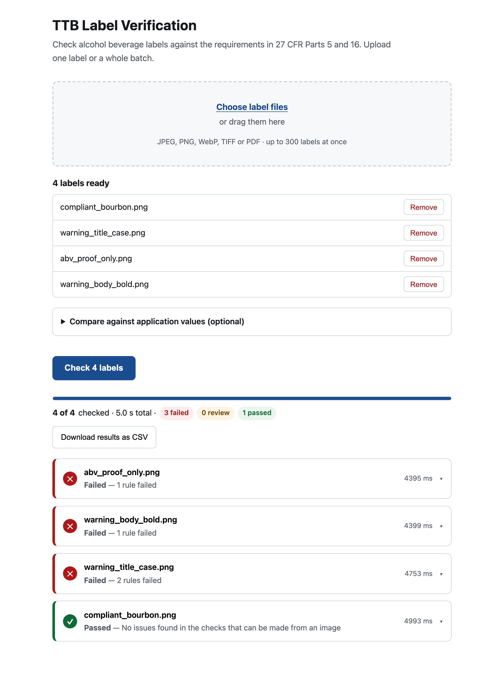
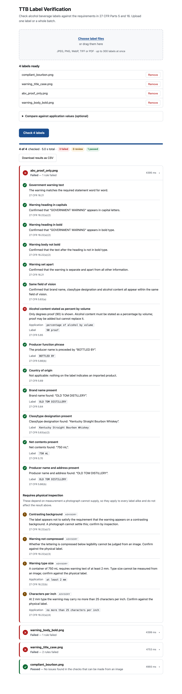

# TTB Label Verification

Drop in a label and the COLA application it belongs to. Both documents are read for you,
compared field by field, and checked against **27 CFR Parts 5 and 16** — with the
regulation cited for every finding and the source documents shown so you can verify the
comparison rather than perform it.

**Live:** https://ttb-label-verification-production-a79a.up.railway.app

Built as a take-home assessment for IT Specialist (AI), Treasury Common Services Center.

---

## What it does

Reads the printed information off a label image, then checks it against the regulations:

- **Government health warning** — exact text per §16.21, heading in capitals and bold,
  body *not* bold per §16.22(a)(2), set apart from other information
- **Mandatory fields** — brand name, class/type, alcohol content, net contents, producer
  name with its function phrase, country of origin for imports
- **Against the application** — compare the label to what was declared on the COLA
  application (TTB F 5100.31)

Every finding names the regulation it came from. Results stream in as each label
finishes, so an agent starts work on a 300-label batch within about four seconds rather
than waiting for the whole run.

### Nothing is retyped

Sarah's description of the job is the clearest line in the brief: *"a lot of what we do is
just... matching. My agents spend half their day doing what's essentially data entry
verification."* A tool that asks an agent to type the application values in order to check
them has not removed that work. So both documents are uploaded and both are read.

**The application is read from the form itself.** TTB F 5100.31 is a fillable AcroForm, so
a digitally completed application is read straight out of its fields — exact strings, no
model, no inference. A form that was printed and scanned falls back to the same vision
extraction the label uses. Which path ran is shown on every result, because an agent should
know whether a value was read or inferred.

**Pairing never guesses.** The serial number identifies an application, but it is never
printed on a label — it is not a labelling requirement under Parts 4, 5, 7 or 16 — so the
two cannot be matched by content. A single label and application pair directly; a batch
pairs on the serial in the filename, then a shared filename, then an unambiguous brand. Two
applications sharing a brand is a question, not a pair, and anything unmatched is reported
with what would fix it.

**The field set follows the form.** There is no class/type field — TTB instructs applicants
not to supply it — and no net contents or alcohol content, both of which were removed; they
are verified against the label's own requirements instead. What the form does declare is
more useful than any string comparison: **field 3, Domestic or Imported**, settles the
country-of-origin requirement instead of inferring it from the producer's wording, and
**field 5** decides whether Part 5 applies at all rather than guessing from the label.

### Three results, not two

`PASS` · `FAIL` · **`REVIEW`**

The third one is the point. This tool exists to clear routine matching off a 47-person
team's desk, not to make final determinations, and two failure modes pull in opposite
directions. Silently passing something a human would have caught defeats the purpose.
Hard-failing something obviously fine — `STONE'S THROW` against `Stone's Throw` — makes
the tool worse than the eye it replaced, and it gets abandoned. `REVIEW` is the honest
answer when a requirement is met in substance but not in form, or when a photograph
cannot supply the evidence a rule needs.

### The interface

One screen. Drop in a label or three hundred; results stream in as each finishes, sorted
worst-first so an agent works the rejections rather than scrolling past the passes.



Expanding a result shows every check, the regulation behind it, and the values compared.
Findings that depend on physical measurement sit under their own heading, marked advisory,
and do not affect the verdict.



---

## Quickstart

```bash
git clone https://github.com/iamnathanswan/ttb-label-verification
cd ttb-label-verification

cp .env.example .env          # add a workspace-scoped ANTHROPIC_API_KEY
python -m venv .venv && .venv/bin/pip install -e ".[dev]"
cd web && npm install && npm run build && cd ..

.venv/bin/uvicorn app.main:app --reload    # http://localhost:8000
```

Sample labels to try are in `tests/fixtures/labels/` — `compliant_bourbon.png` passes,
`warning_title_case.png` fails two rules and shows the word-level diff.

Or with Docker, which is what deploys:

```bash
docker build -t ttb . && docker run -p 8000:8000 --env-file .env ttb
```

### Tests

```bash
.venv/bin/pytest -q                        # 152 tests, no network, no API key needed
cd web && npm test                         # 9 tests
python scripts/gen_traceability.py --check # fails if a requirement has no test
```

---

## Approach

### The model extracts; code judges

Exactly one call in this system is non-deterministic, and it returns a validated
`LabelFields` object. Every compliance determination is a pure function over that object
— no network, no second model call.

```
image ──▶ ingest ──▶ [ model ] ──▶ LabelFields ──▶ rules ──▶ PASS · REVIEW · FAIL
          resize      the only        pydantic      pure          + citation
          EXIF        inference                     functions
          PDF         boundary
```

This is not stylistic. A compliance decision has to be reproducible, auditable, and
explainable by citation — a regulator asks *which rule, and what does it say*, not *what
did the model think*. It also means the entire rule suite runs in milliseconds with no
API key, which is why the test suite needs neither.

The model is never asked whether a label complies. It is asked only what is printed.

### Deliberately not shown the answer

The extraction prompt does **not** contain the §16.21 warning text. Showing the model the
canonical wording invites it to report the canonical wording, silently repairing the exact
defects the check exists to catch — a label reading "Government Warning" in title case
would come back normalised. The model transcribes; the comparison happens in code.

### Opposite normalisation, on purpose

`rules/warning.py` compares the warning after whitespace normalisation **only**. §16.21
prescribes the statement word for word, so a title-case heading is a genuine rejection.

`rules/match.py` folds case, punctuation, accents and spacing, because a brand-name
casing difference is not a discrepancy.

The two policies conflict by design and must never share a helper.

### What a photograph cannot decide

§16.22 sets minimum type size in millimetres and maximum characters per inch. An image
carries no reliable scale, so these checks report the applicable threshold and route to a
person — they never produce an automated failure.

They also never affect the verdict. An advisory that fires identically on every label
carries no information about *this* label, and folding it into the result would make every
result `REVIEW` — which tells an agent nothing and abandons the triage the tool is for.
Advisories are shown under their own heading, clearly marked.

---

## Measured

| | |
|---|---|
| Single label | **p50 4,185 ms · p95 4,242 ms** (budget ~5,000 ms), n=12 |
| Batch of 10 | **8,407 ms total** — 5.3× faster than 44,707 ms sequential |
| Under concurrency | per-label p50 4,424 ms · p95 4,843 ms |
| Corpus | **10/10** fixtures behave as documented, against the deployed service |
| Tests | 152 Python · 9 JavaScript · 52/52 requirements verified |

`docs/perf.md` · `docs/verification.md` — both generated by scripts, not transcribed.

**Model: `claude-sonnet-5`**, chosen on measured latency against a binding requirement,
not on cost. Opus 5 missed the budget at 5,590 ms; Sonnet 5 meets it with identical
accuracy on the four fixtures where a wrong typographic judgement flips the verdict.
Configurable via `ANTHROPIC_MODEL`.

Latency is dominated by output generation. Shrinking the image and disabling thinking were
both measured and neither helped; the full table of what was tried is in `docs/perf.md`.

Structured outputs were abandoned: constrained decoding against this schema exceeded
**120 seconds** per label. The schema is supplied to the model as documentation in the
cached system prompt and the response validated afterwards, which preserves the guarantee
and costs about four seconds.

---

## Assumptions and open questions

The instructions left five things genuinely ambiguous. Each was resolved rather than
asked, and recorded in `docs/requirements.md` §J.

**Is this label-only verification, or label-versus-application matching?** The interviews
describe matching against an application record; the deliverables describe extracting
fields from a label, with no application record in the spec. *Both were built.* Compliance
checks always run; application values are optional, and enable the matching layer when
supplied. Neither reading can be wrong.

**Does "about 5 seconds" mean per label or per batch?** 300 labels in 5 seconds is not
achievable and 300 × 5 s sequentially is 25 minutes, which fails the intent. The figure is
quoted against a vendor taking 30–40 seconds for *one* label, so it is a per-label
benchmark. Batch results stream, so the first lands inside the same budget.

**Which beverage types?** Part 5 (distilled spirits) is implemented fully, since the sample
is a bourbon. Parts 4 and 7 govern wine and malt beverages and differ; those labels get the
universal Part 16 warning checks, and type-specific fields are marked unverified rather
than failed against a citation that does not govern them.

**Where does the warning text come from?** The brief says only "[Standard government
warning text]". Taken from 27 CFR §16.21 as published by the GPO, embedded as a versioned
constant with the citation inline.

**Is an external model API acceptable, given the firewall?** Marcus reports that outbound
traffic to many domains is blocked. That constraint does not bind this prototype, and the
reason matters: it governs traffic leaving TTB's network, while this runs outside it — an
agent's browser makes one connection, to this URL, and the inference call is made by the
application host. The scanning vendor failed because its product called ML endpoints *from
inside* the network.

It would bind a production deployment. There the remedy is not a firewall exception but
moving inference inside the trust boundary; TTB migrated to Azure in 2019, so
Azure-hosted inference is the natural path. That is why the SDK is reachable only through
`ExtractionProvider` — switching is a constructor change, and a test asserts nothing
outside `app/providers/` imports it.

---

## Limitations

**Physical measurements are advisory, not verified.** Type size, characters per inch,
compression and background contrast are millimetre judgements. This reports the applicable
threshold and routes to a person. Claiming to verify type size from a JPEG would not
survive questioning.

**Only distilled spirits rules are complete.** Wine and malt beverage labels get the
warning checks and are otherwise marked unverified.

**Import status is inferred when no application is supplied.** Field 3 declares Domestic or
Imported and settles the country-of-origin requirement definitively. Without an
application, import status can only be inferred from the producer's function phrase, so an
imported product whose label never says so will not be caught.

**Pairing a large batch depends on filenames.** With one label and one application there is
no ambiguity. Across hundreds, pairing works from the serial number or a shared filename;
where neither is present it falls back to brand, and reports anything it cannot settle
rather than guessing. A production deployment reading from COLA directly would not need
this at all.

**Extraction is not infallible.** The corpus covers ten deliberate defects and passes, but
a sufficiently unusual layout may be misread. Low-confidence fields are reported, and the
three-state design means an uncertain reading routes to a person rather than producing a
confident wrong answer.

**No authentication.** Out of scope for a prototype. The endpoint is rate-limited, upload
size and batch size are capped, and nothing is stored.

**The rate limiter is in-process and best-effort.** One container is the whole deployment;
a shared store would add a dependency and its failure modes for no benefit at this scale.

**Not integrated with COLA.** Explicitly out of scope per the brief — this is a standalone
proof of concept.

---

## Security

Reviewed against what this application actually does: accept untrusted uploads over a
public URL, call a paid API, and return text derived from the uploaded image. Findings and
disposition in `docs/security.md`. Two were fixed during review:

- **Decompression bomb** — a 136 KB PNG decodes to 144 megapixels, which at the configured
  concurrency is enough to exhaust the container. Pillow only warns; dimensions are now
  checked from the header before any pixel data is decoded.
- **CSV injection** — exported rows carry extracted label text, so a brand name of
  `=cmd|'/c calc'!A1` would execute when the file is opened. Leading formula characters are
  neutralised.

Worth noting that **prompt injection via label text cannot change a verdict.** The model
only transcribes, and every determination is a pure function over that transcription. The
worst a crafted label achieves is a misread field — which is what human review is for.
That falls out of the architecture rather than being a control bolted on.

---

## Repository

```
app/
  ingest.py          decode · EXIF · downscale · PDF render
  models.py          LabelFields — the contract at the model boundary
  providers/         ExtractionProvider seam; the SDK lives here and nowhere else
  rules/
    constants.py     regulatory text and thresholds, each beside its citation
    warning.py       VAL-01..09   §16.21, §16.22
    fields.py        VAL-10..14   §5.63, §5.65, §5.66, §5.69
    match.py         MCH-01..06   label versus application
    engine.py        composition, commodity gating, overall status
  api.py  batch.py  limits.py
web/src/             React — one screen, streaming results, CSV export
docs/
  requirements.md    58 requirements; binding ones quote their source
  plan.md            architecture and decisions D1–D8
  perf.md            latency, and everything tried that did not help
  verification.md    corpus results (generated)
  traceability.md    requirement → implementation → test (generated)
  security.md        findings and disposition
scripts/             benchmark · corpus verification · traceability
```

### Built with

Python 3.12 · FastAPI · Pydantic · Pillow · PyMuPDF · pytest · ruff
React 18 · Vite · vitest
Docker → Railway · GitHub Actions
Claude Sonnet 5 for extraction

Development was AI-assisted throughout, using Claude Code. `CLAUDE.md` is the working
agreement that kept it on spec — the architectural invariant, the hard constraints, and
the domain pitfalls that are easy to get backwards.
